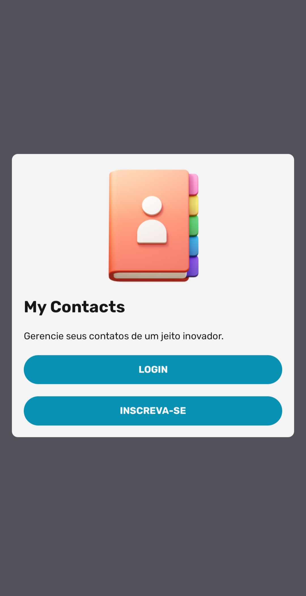
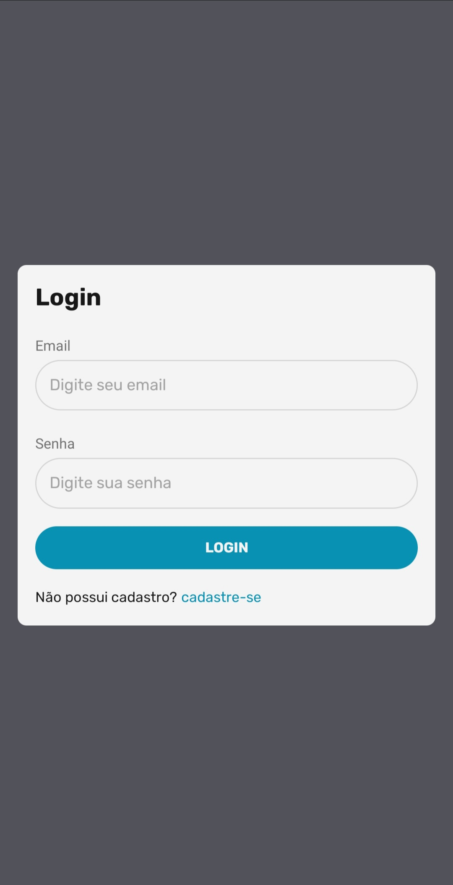
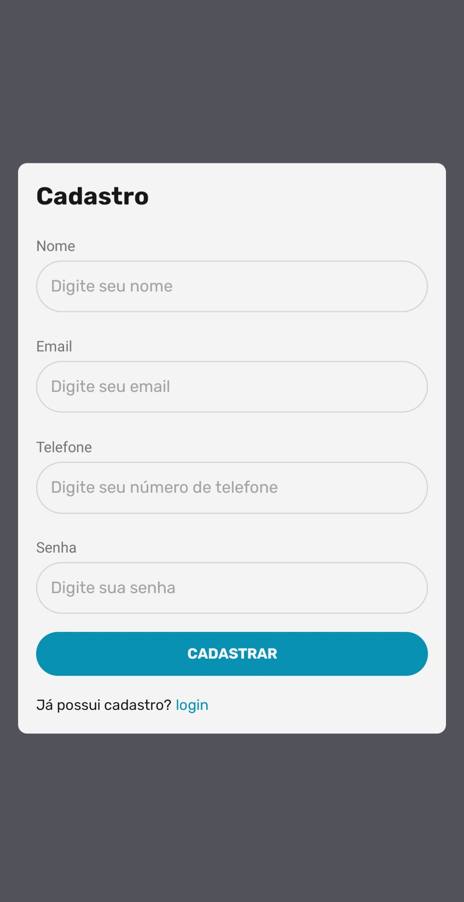
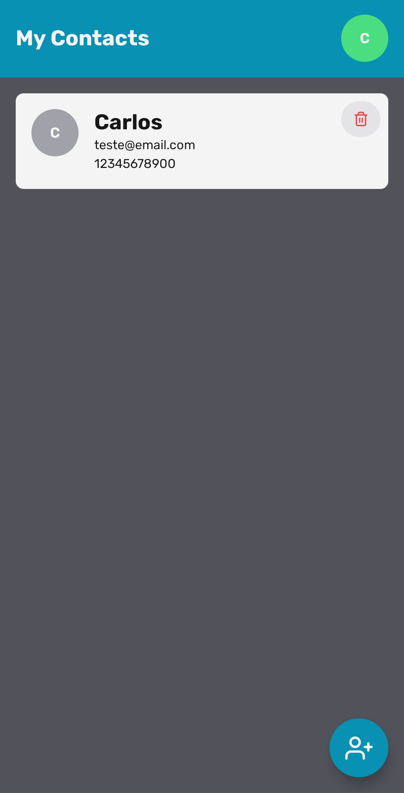
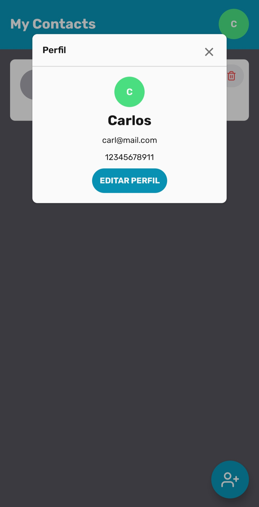
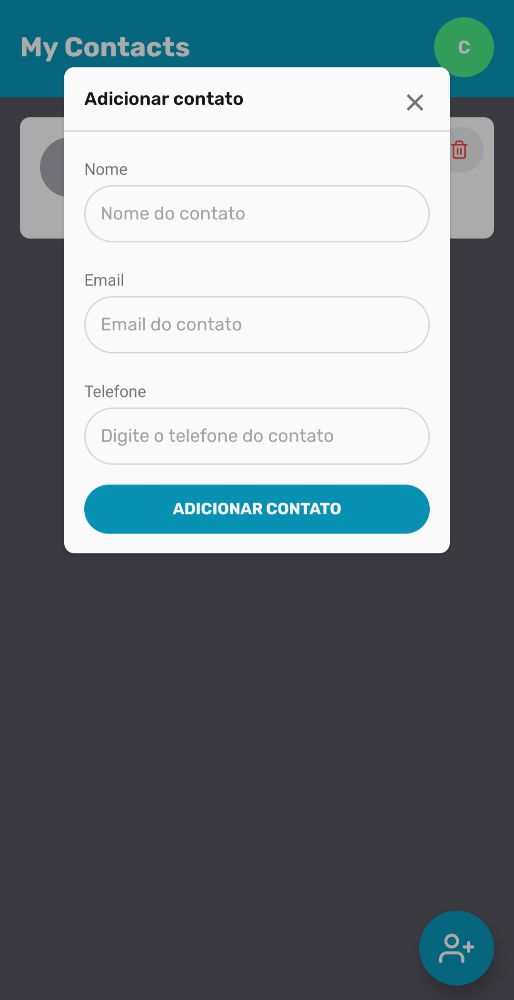

# MY CONTACTS MOBILE

Esta é uma aplicação desenvolvida anteriormente utilizando React no frontend e Node.js no backend. Agora também foi criada uma versão mobile. Trata-se de uma agenda de contatos simples e intuitiva, projetada para facilitar a gestão dos seus contatos.


## Screenshots

<div style="display:grid; grid-template-column: repeat(3, 1fr);">
  
  
  
  
  
  
</div>


## Rodando localmente

Clone o projeto

```bash
  git clone git@github.com:CarlosX26/my-contacts-mobile.git
```

Entre no diretório do projeto

```bash
  cd my-contacts-mobile
```

Instale as dependências

```bash
  npm install
```

Inicie o servidor

```bash
  npx expo start
```


## Stack utilizada

**Front-end:** React Native, TypeScript, Expo e Native Base.

